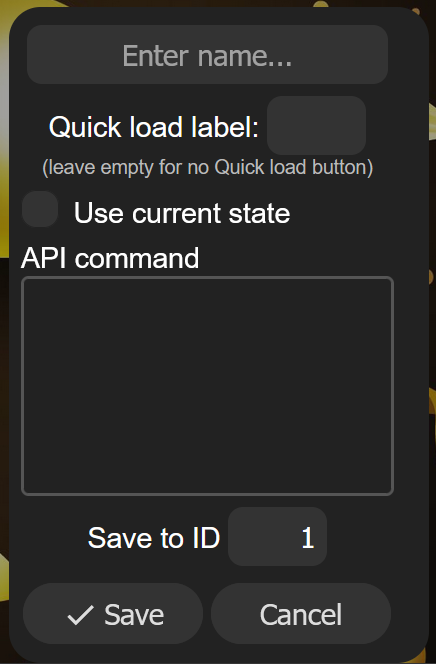

# wled-presets

[WLED](https://kno.wled.ge) presets I want to keep in source control

As a personal convention, if a preset is prefixed with `///`, it has segment-specific settings I want to keep.

* [Office wall](./office-wall.json)
* [Roof line](./roof-line.json)

## Usage

Copy a line from the json into a new preset in your WLED dashboard.

In the new Preset window, uncheck "Use current state" and paste in the value. Skip the "0"/"1"/"2" prefix in the JSON file - that's the ID.

## Todo?

- [ ] Add a script to automatically pull the json files from my WLED instances into this repo
- [ ] Add a script to automatically format the json files, stripping unnecessary info (LED counts, etc.)
